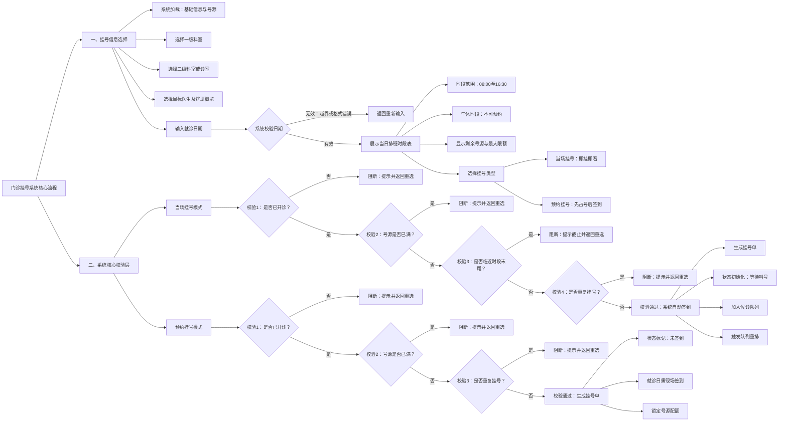

# 患者挂号完整流程树图（详细说明版）

> 本文件可作为 AI 绘图提示词使用，也可直接放入报告作为结构化流程说明。
> 包含：患者端所有分支、系统校验层、医生端联动、异常与取消流程。

---

## 一、流程总览

```
[患者进入系统]
    │
    ├─→ 未注册 → [注册账号] → 自动生成患者编号(P+8位数字)
    │
    └─→ 已注册 → [登录验证] ──→ 欠费检查(余额≤-2000?) ──→ 强制充值 ──→ 返回登录
                │
                └─→ 通过 ──→ [患者服务台主菜单]
                                │
                                ├─→ "挂号和签到" ──→ [挂号流程]
                                │
                                └─→ "仅签到" ──────→ [签到流程]（跳转至签到节点）
```

---

## 二、挂号信息选择（患者端）

```
[挂号流程开始]
    │
    ├─→ 系统加载：医生列表 / 科室树 / 当日排班 / 号源余量
    │
    ├─→ 患者选择【一级科室】（内科 / 外科 / 儿科 ...）
    │
    ├─→ 患者选择【二级科室/诊室】（如：心内科 / 诊室A201）
    │
    ├─→ 患者选择【目标医生】（显示所属科室、当日排班概览）
    │
    ├─→ 患者输入【就诊日期】
    │       │
    │       └─→ 系统校验：isValidDate(YYYY-MM-DD)
    │               ├─→ 无效：年份不在2026~当前年+2范围内 / 月份>12 / 日期越界 / 非闰年2月29日
    │               │       └─→ 返回重新输入日期
    │               └─→ 有效：进入下一步
    │
    └─→ 系统展示该医生【当日排班时段表】
            │
            ├─→ 时段范围：08:00-16:30，每半小时一段（共17个时段）
            ├─→ 午休时段 11:30-13:30 显示为"不可预约"
            ├─→ 每个可预约时段显示：剩余号源 / 最大限额(MAX_APP=5)
            │
            └─→ 患者选择【挂号类型】
                    │
                    ├─→ 【当场挂号】（即挂即看）
                    │
                    └─→ 【预约挂号】（先占号，就诊日再签到）
```

---

## 三、系统核心校验层

### 3.1 当场挂号校验分支

```
[当场挂号模式]
    │
    ├─→ 校验①：该时段医生是否已开诊？
    │       │
    │       ├─→ 否（quota[slot] == 0）──→ 【阻断】提示："该时段医生未开诊，请选择其他时段"
    │       │                                   └─→ 返回时段选择
    │       └─→ 是 ──→ 继续
    │
    ├─→ 校验②：号源是否已满？
    │       │
    │       ├─→ 是（bookedCount[slot] >= quota[slot]，即≥5人）
    │       │       └──→ 【阻断】提示："该时段号源已满"
    │       │               └─→ 返回时段选择
    │       └─→ 否 ──→ 继续
    │
    ├─→ 校验③：是否处于时段末3分钟内？
    │       │
    │       ├─→ 是 ──→ 【阻断】提示："当场挂号已截止，请预约下一时段"
    │       │       └─→ 返回时段选择
    │       └─→ 否 ──→ 继续
    │
    ├─→ 校验④：是否重复挂号？
    │       │   （同一患者 + 同一医生 + 同一日期 + 同一时段）
    │       │
    │       ├─→ 是 ──→ 【阻断】提示："您已在该时段预约此医生，不可重复挂号"
    │       │       └─→ 返回时段选择
    │       └─→ 否 ──→ ✅ 校验全部通过
    │
    └─→ ✅ 系统自动执行【签到】
            ├─→ 生成 QueueTicket（挂号单）
            ├─→ 状态初始化为 STATUS_WAITING（等待叫号）
            ├─→ 将该患者加入该医生-日期-时段的候诊队列
            └─→ 触发 refreshSlotQueue（队列刷新与重排）
```

### 3.2 预约挂号校验分支

```
[预约挂号模式]
    │
    ├─→ 校验①：该时段医生是否已开诊？
    │       ├─→ 否 ──→ 【阻断】提示未开诊，返回重选
    │       └─→ 是 ──→ 继续
    │
    ├─→ 校验②：号源是否已满？
    │       ├─→ 是 ──→ 【阻断】提示号源已满，返回重选
    │       └─→ 否 ──→ 继续
    │
    ├─→ 校验③：是否重复挂号？
    │       ├─→ 是 ──→ 【阻断】提示不可重复挂号，返回重选
    │       └─→ 否 ──→ ✅ 校验全部通过
    │
    └─→ ✅ 生成 QueueTicket
            ├─→ 状态标记为"未签到"
            ├─→ 患者需在就诊日到达医院后执行【签到】
            └─→ 系统记录预约信息，锁定该时段1个号源（bookedCount+1）
```

---

## 四、签到流程（患者端）

```
[签到入口]
    │
    ├─→ 来源A：当场挂号患者（已由系统自动签到，跳过此步，直接进入队列）
    │
    └─→ 来源B：预约挂号患者 / "仅签到"菜单进入
            │
            ├─→ 患者选择要签到的预约记录
            │
            ├─→ 系统获取当前时间，计算与预约时段的关系
            │
            ├─→ 校验①：是否提前超过5分钟？
            │       ├─→ 是 ──→ 【阻断】提示："最早提前5分钟签到"
            │       │       └─→ 返回等待
            │       └─→ 否 ──→ 继续
            │
            ├─→ 校验②：是否处于时段最后3分钟内？
            │       ├─→ 是 ──→ 【阻断】提示："该时段签到已截止"
            │       │       └─→ 标记爽约或引导重新挂号
            │       └─→ 否 ──→ 继续
            │
            ├─→ 校验③：是否迟到超过1小时？
            │       ├─→ 是 ──→ 【阻断】提示："预约已过期，请重新挂号"
            │       │       └─→ 该预约单标记为超时/失效
            │       └─→ 否 ──→ ✅ 签到成功
            │
            └─→ ✅ 计算迟到时长并分级
                    │
                    ├─→ 【准时】实际签到时间落在预约时段内
                    │       └──→ 标签：准时，优先级最高
                    │
                    ├─→ 【迟到≤30分钟】超出预约时段0~30分钟内签到
                    │       └──→ 标签：迟到30分钟，队列插入第3位之后
                    │
                    ├─→ 【迟到≤60分钟】超出预约时段30~60分钟内签到
                    │       └──→ 标签：迟到60分钟，队列插入第6位之后
                    │
                    └─→ 【迟到>60分钟】超出预约时段60~120分钟内签到
                            └──→ 标签：迟到超60分钟，排在队列末尾
```

### 4.1 队列刷新与排序规则（系统内部）

```
[refreshSlotQueue 触发条件]
    │
    ├─→ 触发时机：任何患者签到成功后 / 医生叫号后 / 系统启动加载数据后
    │
    └─→ 执行逻辑：
            │
            ├─→ Step 1：收集该医生-日期-时段下所有已签到且状态为WAITING的患者
            │
            ├─→ Step 2：按迟到标签分为四组
            │       ├─→ Group A：准时患者
            │       ├─→ Group B：迟到≤30分钟
            │       ├─→ Group C：迟到≤60分钟
            │       └─→ Group D：迟到>60分钟
            │
            ├─→ Step 3：组内按【签到顺序】二次排序（先签到在前）
            │
            ├─→ Step 4：按规则合并队列
            │       ├─→ 首先放入 Group A（准时患者全部在前）
            │       ├─→ Group B 整体插入到第3位患者之后
            │       ├─→ Group C 整体插入到第6位患者之后
            │       └─→ Group D 排在队列最末尾
            │
            └─→ Step 5：医生端【候诊队列】实时更新显示
```

---

## 五、医生端叫号与就诊联动

### 5.1 医生工作站准备

```
[医生端入口]
    │
    ├─→ 医生登录工作站（编号 + 密码验证）
    │       ├─→ 失败 ──→ 返回主菜单
    │       └─→ 成功 ──→ 加载医生专属数据
    │
    ├─→ 系统自动加载：
    │       ├─→ 医生个人信息与排班表
    │       ├─→ 当日候诊队列（所有状态为WAITING的患者）
    │       ├─→ 历史看诊记录
    │       ├─→ 药品目录
    │       ├─→ 检查项目字典
    │       └─→ 住院患者信息
    │
    └─→ 医生进入【医生工作站主菜单】
            │
            └─→ 选择"查看挂号候诊队列"
                    └─→ 显示格式化列表：
                            序号 | 患者姓名 | 患者编号 | 预约时段 | 签到时间 | 迟到标签 | 当前状态
```

### 5.2 叫号流程

```
[医生点击"排队叫号"]
    │
    ├─→ 系统执行 callNextPatient()
    │       ├─→ 从该医生-日期-时段队列的【头部】取出第一位患者
    │       ├─→ 系统播报/显示："请患者 XXX 到 Y诊室就诊"
    │       └─→ 该患者 QueueTicket 状态更新为：STATUS_CALLED（已叫号）
    │
    ├─→ 【分支：患者应号】
    │       │
    │       ├─→ 患者在5分钟内到达诊室并应号
    │       │       └─→ 状态更新：STATUS_CALLED → STATUS_IN_ROOM（就诊中）
    │       │               └─→ 医生端显示："患者已进入诊室"
    │       │
    │       └─→ 患者5分钟内未应号（过号）
    │               └─→ 状态更新：STATUS_CALLED → STATUS_MISSED（过号未应）
    │                       ├─→ 该患者被移出当前叫号位
    │                       ├─→ 系统记录过号次数
    │                       └─→ 医生可再次呼叫下一位
    │
    └─→ 【医生手动优先级】（可选）
            ├─→ 医生可指定某位等待患者为"优先看诊"
            └─→ 该患者 priorityOrder 提升，下次叫号时优先被呼叫
```

### 5.3 就诊中医生操作分支

```
[患者状态：STATUS_IN_ROOM 就诊中]
    │
    └─→ 医生可进行以下操作（联动患者端状态）：
            │
            ├─→ 【查看病历】
            │       ├─→ 系统读取该患者全部历史记录
            │       │       （挂号记录 / 看诊记录 / 处方记录 / 住院记录 / 检查记录）
            │       └─→ 医生浏览，患者端无感知
            │
            ├─→ 【写入看诊记录】
            │       ├─→ 医生输入病情诊断、医嘱
            │       └─→ 系统追加 ConsultationRecord（类型 REC_VIEW）到患者viewHead链表
            │
            ├─→ 【开具处方】
            │       ├─→ 医生查询药品目录（库存状态：正常/缺货）
            │       ├─→ 选择药品并输入用量
            │       ├─→ 系统校验库存充足？
            │       │       ├─→ 否 ──→ 提示缺药，无法添加
            │       │       └─→ 是 ──→ 计算总金额
            │       ├─→ 系统扣除患者余额（优先扣除赠送余额）
            │       │       ├─→ 余额不足 ──→ 提示患者充值
            │       │       └─→ 扣费成功 ──→ 扣除对应药品库存
            │       ├─→ 累加医院收入
            │       └─→ 追加处方记录（类型 REC_MED）到患者medHead链表
            │
            ├─→ 【开具检查单】
            │       ├─→ 医生从检查项目字典选择项目（支持序号/编号/关键词"全选"）
            │       ├─→ 系统生成 ExamOrder（单号自增 X0000001）
            │       ├─→ 患者端"进行检查"菜单可见该待执行检查单
            │       └─→ 患者执行检查时自动扣费并生成检查结果
            │
            ├─→ 【安排住院】
            │       ├─→ 医生发起住院申请
            │       ├─→ 系统调用 autoRecommendWard() 智能推荐病房
            │       │       ├─→ 急诊患者 → 优先 ICU
            │       │       ├─→ VIP患者 → 优先 VIP病房
            │       │       ├─→ 普通患者 → 优先普通病房
            │       │       └─→ 同类型内按：同科室>价格>入住率>床位数 排序
            │       ├─→ 分配具体床位（bedId = wardId + 两位序号）
            │       ├─→ 预扣7天押金（病房日价 × 7）
            │       │       └─→ 余额不足 ──→ 阻止住院，提示充值
            │       └─→ 写入 StayRecord 到患者 stayHead 链表
            │
            └─→ 【结束看诊】
                    ├─→ 医生确认结束本次就诊
                    ├─→ 患者状态：STATUS_IN_ROOM → STATUS_FINISHED（就诊结束）
                    ├─→ 自动保存本次看诊产生的所有记录到内存链表
                    ├─→ 释放医生"当前在诊患者"占用
                    └─→ 医生可继续呼叫下一位患者
```

---

## 六、取消、爽约与异常分支

### 6.1 患者主动取消预约

```
[患者取消预约]
    │
    ├─→ 患者在【就诊日前】主动取消
    │       │
    │       ├─→ 系统释放该时段号源（bookedCount - 1）
    │       ├─→ QueueTicket 状态更新：STATUS_CANCELLED
    │       └─→ 提示："取消成功，号源已释放"
    │
    └─→ 患者在【就诊日当天/之后】才尝试取消
            │
            └─→ 已超过时段 ──→ 系统拒绝取消
                    └─→ 自动转为"爽约/未签到"处理流程
```

### 6.2 爽约/未签到处理

```
[爽约判定条件]
    │
    ├─→ 条件A：预约挂号患者，就诊日完全未执行签到
    ├─→ 条件B：签到时已超过预约时段1小时以上
    └─→ 条件C：被叫号后 STATUS_CALLED 但患者未应号，且医生标记为MISS
            │
            └─→ 统一处理：
                    ├─→ QueueTicket 状态更新为 STATUS_CANCELLED 或 STATUS_MISSED
                    ├─→ 该时段号源视为已消耗（不释放，防止恶意占号）
                    ├─→ 记录进入患者信用档案（登录次数、爽约次数影响后续挂号优先级）
                    └─→ 患者如需就诊，必须重新挂号
```

---

## 七、患者端就诊反馈（联动闭环）

```
[患者收到叫号]
    │
    ├─→ 患者前往指定诊室
    │
    ├─→ 到达后应号 ──→ 状态变为"就诊中"
    │
    ├─→ 诊室内配合医生完成看诊/处方/检查/住院申请
    │
    ├─→ 医生结束看诊 ──→ 患者状态变为"就诊结束"
    │
    └─→ 患者离开诊室后：
            │
            ├─→ 如有处方 ──→ 前往药房缴费取药
            ├─→ 如有检查单 ──→ 前往检查科室执行检查
            ├─→ 如已住院 ──→ 前往病房办理入住
            └─→ 无待办 ──→ 就诊流程完全结束
```

---

## 八、系统定时任务联动（住院计费）

```
[系统每日08:00自动触发]
    │
    └─→ chargeAllInpatientsDaily()
            │
            ├─→ 遍历所有 Patient 的 stayHead 链表
            ├─→ 筛选出 endDate 为"未出院"的在住患者
            ├─→ 根据关联 wardId 获取病房日价格
            ├─→ 从患者余额扣除日费用（优先赠送余额）
            ├─→ 累加到医院总收入
            ├─→ 余额不足时记录欠费（影响后续登录）
            └─→ 患者端"查看住院信息"可看到每日扣费明细
```

---

## 九、数据流向图（简化版）

```
┌─────────────┐     ┌─────────────┐     ┌─────────────┐
│   患者端    │ ──→ │  系统校验层  │ ──→ │   医生端    │
│  (挂号/签到)│     │(排班/防重/  │     │ (叫号/看诊) │
│             │ ←── │ 队列/计费)  │ ←── │             │
└─────────────┘     └─────────────┘     └─────────────┘
       │                   │                   │
       └───────────────────┼───────────────────┘
                           ↓
                    ┌─────────────┐
                    │  文件持久化  │
                    │ HIS_*.txt   │
                    └─────────────┘
```

---

## 使用建议

1. **作为 AI 绘图提示词**：将上述 `## 二 ~ ## 七` 的文本流程复制给支持 Mermaid 或流程图生成的 AI（如 Claude、ChatGPT、Kimi），并附加指令："请将上述流程绘制成一张横向流程图，使用不同颜色区分患者端（蓝色）、系统校验（橙色）、医生端（绿色）、异常分支（红色）。"

2. **放入 Word 报告**：直接复制 `## 二 ~ ## 七` 的文本树作为"详细流程说明"章节，配合 Mermaid 源码文件 `患者挂号完整流程图.mmd` 中的图形版使用。

3. **渲染 Mermaid 图形**：将 `患者挂号完整流程图.mmd` 文件内容粘贴到以下任一平台查看图形：
   - Mermaid Live Editor (https://mermaid.live)
   - Typora / Obsidian / Notion（支持 Mermaid 的笔记软件）
   - VS Code + Mermaid 插件

以下是为您整理的单向向右分支（Left-to-Right）思维导图。

### 方式一：Mermaid 渲染图

使用 `graph LR` 结构确保所有分支均向右侧展开：



---

### 方式二：Markdown 文本导图（支持一键导入 XMind 等软件）

您可以直接复制以下文本列表，粘贴到绝大多数思维导图软件中，系统会自动将其识别并生成所有分支向右的思维导图：

* 门诊挂号系统核心流程
* 一、挂号信息选择
* 系统加载：医生列表 / 科室树 / 当日排班 / 号源余量
* 选择一级科室
* 选择二级科室及诊室
* 选择目标医生
* 输入就诊日期
* 系统校验日期
* 无效（年份越界 / 月份错误 / 日期越界 / 闰年异常）：返回重新输入
* 有效：进入下一步


* 展示医生当日排班时段表
* 时段范围：08:00至16:30，每半小时一段
* 屏蔽限制：午休时段不可预约
* 额度显示：剩余号源 / 最大限额


* 选择挂号类型
* 当场挂号（即挂即看）
* 预约挂号（先占号，就诊日签到）


* 二、系统核心校验层
* 当场挂号模式
* 校验①：医生是否已开诊？
* 否：阻断，返回重选
* 是：继续


* 校验②：号源是否已满？
* 是：阻断，返回重选
* 否：继续


* 校验③：是否处于时段末端限制内？
* 是：阻断，返回重选
* 否：继续


* 校验④：是否重复挂号？
* 是：阻断，返回重选
* 否：校验全部通过


* 执行结果：系统自动执行签到
* 生成挂号单
* 状态初始化为等待叫号
* 患者加入对应候诊队列
* 触发队列刷新与重排


* 预约挂号模式
* 校验①：医生是否已开诊？
* 否：阻断，返回重选
* 是：继续


* 校验②：号源是否已满？
* 是：阻断，返回重选
* 否：继续


* 校验③：是否重复挂号？
* 是：阻断，返回重选
* 否：校验全部通过


* 执行结果：生成挂号单
* 状态标记为未签到
* 提示就诊日到达后执行签到
* 锁定该时段对应号源