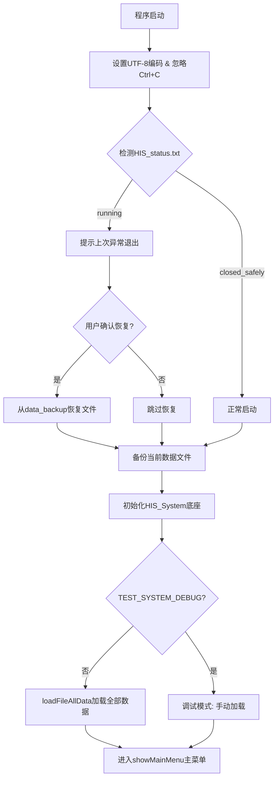
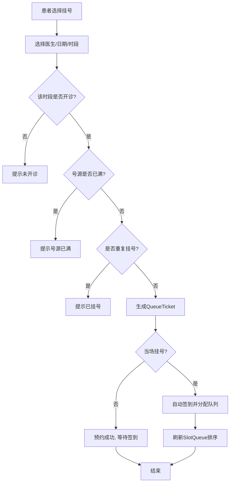
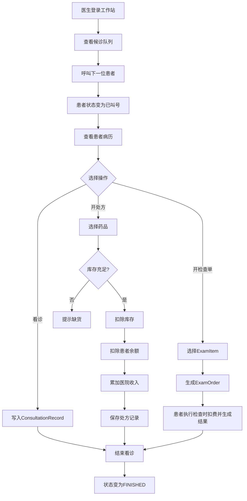
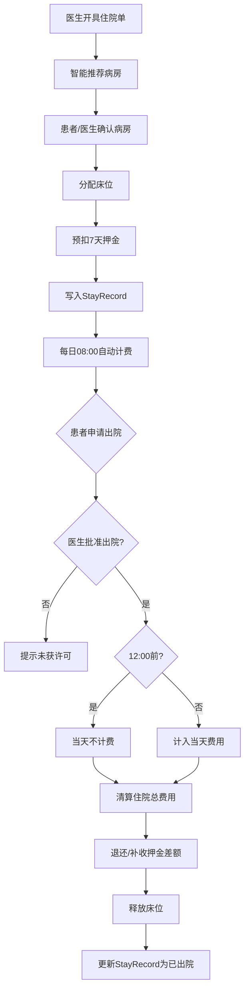
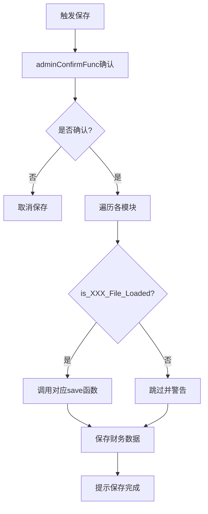

# MediCare_HIS_2026 项目总结报告

> 基于全部 `.c` / `.h` 源码文件的完整分析与总结

---

## 一、系统概述

### 1.1 项目背景
**MediCare_HIS_2026** 是《程序设计基础课程设计》（2025/2026级）的自拟题项目，目标是用 **纯C语言** 实现一个**轻量级医院信息系统（Hospital Information System, HIS）**。系统需管理至少100名患者、30名住院患者、20名医生、5个科室及20类药品，并覆盖门诊、住院、药品、检查等核心业务。

### 1.2 技术栈与运行环境
| 项目 | 说明 |
|------|------|
| **编程语言** | C语言（C99标准，全程链表实现） |
| **开发环境** | Microsoft Visual Studio 2022（含 `.sln` 解决方案） |
| **运行平台** | Windows 控制台（`SetConsoleOutputCP(65001)` 强制 UTF-8 中文显示） |
| **数据持久化** | 纯文本文件（标签化格式，如 `P`、`R`、`V`、`S`、`END` 等） |
| **数据结构** | 单向链表（全部业务模块均采用链表实现，无数组固定上限） |
| **代码组织** | 高度模块化，共约 **52** 个 `.c`/`.h` 文件，按业务域拆分 |

### 1.3 核心架构
系统采用 **`HIS_System`** 全局底座结构体作为中央容器，持有各业务模块的链表头指针。程序入口为 **`main.c`**，启动后初始化系统、加载数据、进入**三角色分视角菜单循环**：

- **管理员**：系统维护、数据增删改查、财务统计、数据保存
- **医生**：登录工作站、排班、叫号、看诊、开处方、开检查单、住院管理
- **患者**：注册/登录、挂号签到、充值、查看病历、执行检查、办理出院

### 1.4 项目文件清单（按域分类）

| 业务域 | 文件 |
|--------|------|
| **系统底座** | `HIS_System.c/h`, `HIS_StartMenu.c/h`, `main.c` |
| **工具库** | `InputUtils.c/h`, `ConfirmFunc.c/h`, `PauseUtil.c/h`, `PrintFormattedStr.c/h`, `StringCheck.c/h`, `DayTimeUtils.c/h`, `BufferClear.c/h` |
| **数据备份** | `BackupRestore.c/h` |
| **药品** | `DrugManage.c/h`, `DrugFileManage.c/h`, `DrugSort.c/h` |
| **医生** | `DoctorManage.c/h`, `DoctorFileManage.c/h`, `DoctorSort.c/h` |
| **科室** | `DepartmentManage.c/h`, `DepartmentFileManage.c/h`, `DepartmentSort.c/h` |
| **病房/床位** | `WardManage.c/h`, `WardFileManage.c/h`, `WardSort.c/h` |
| **患者** | `PatientManage.c/h`, `PatientFileManage.c/h`, `PatientSort.c/h` |
| **排队挂号** | `QueueManage.c/h`, `QueueFileManage.c/h` |
| **检查** | `ExamManage.c/h`, `ExamFileManage.c/h` |

---

## 二、数据约定与规范

### 2.1 全局常量定义（`ProjectLimits.h`）

| 宏 | 值 | 含义 |
|----|----|------|
| `STR_LEN` | 50 | 通用字符串长度 |
| `ID_LEN` | 25 | 编号长度 |
| `BED_ID_LEN` | 64 | 床位编号长度 |
| `DATE_STR_LEN` | 20 | 日期字符串长度 |
| `TIME_STR_LEN` | 10 | 时间字符串长度 |
| `MAX_WARD_BEDS` | 10 | 单个病房最大床位数 |
| `MAX_APP` | 5 | 每时段最大预约数 |
| `SLOT_COUNT` | 17 | 每日挂号时段数（08:00–16:30，每半小时一段） |
| `STARTING_PATIENT_ID` | 10000000 | 患者编号起始值 |

### 2.2 核心数据结构（`HIS_System.h`）

系统采用**分层链表**组织数据：

**（1）药品链表**
```c
typedef struct Drug {
    char drugId[ID_LEN];        // 药品编号
    char drugGbCode[16];        // 国家药品本位码（14位）
    char genericName[STR_LEN];  // 通用名
    char tradeName[STR_LEN];    // 商品名
    char alias[STR_LEN];        // 别名
    int stock;                  // 库存
    double price;               // 单价
    struct Drug* next;
} Drug;
```

**（2）医生链表（含排班子链表）**
```c
typedef struct DoctorSchedule {
    char day[DATE_STR_LEN];
    int quota[SLOT_COUNT + 1];       // 各时段预约限额
    int bookedCount[SLOT_COUNT + 1]; // 已预约数
    struct DoctorSchedule* next;
} DoctorSchedule;

typedef struct doctor {
    char doctorId[ID_LEN];
    char doctorName[STR_LEN];
    char department[STR_LEN];      // 一级科室
    char subDepartment[STR_LEN];   // 二级科室
    char subDeptId[ID_LEN];        // 诊室编号
    char password[STR_LEN];
    DoctorSchedule* scheduleHead;  // 排班链表
    struct doctor* next;
} doctor;
```

**（3）科室二级链表**
```c
typedef struct SubDepartment {
    char subDeptName[STR_LEN];
    char subDeptId[ID_LEN];
    struct SubDepartment* next;
} SubDepartment;

typedef struct Department {
    char categoryName[STR_LEN];    // 一级科室名称
    char categoryId[ID_LEN];       // 一级科室代码
    SubDepartment* subDeptHead;    // 下属诊室链表
    struct Department* next;
} Department;
```

**（4）病房-床位嵌套链表**
```c
typedef struct Bed {
    char bedId[BED_ID_LEN];
    bool isOccupied;
    char patient[ID_LEN];
    struct Bed* next;
} Bed;

typedef struct Ward {
    char wardId[ID_LEN];
    WardType type;              // NORMAL / VIP / ICU
    char department[STR_LEN];
    double price;               // 每日价格
    Bed* bedListHead;
    struct Ward* next;
} Ward;
```

**（5）患者及子链表**
```c
typedef struct Patient {
    char patientId[ID_LEN];
    char name[STR_LEN];
    char phone[ID_LEN];
    char idCard[21];            // 身份证号
    char gender[STR_LEN];
    int age;
    PatientType type;           // GENERAL / VIP / EMERGENCY
    double realBalance;         // 实际充值余额
    double bonusBalance;        // 赠送余额
    int loginCount;

    RegistrationRecord* regHead;    // 挂号记录
    ConsultationRecord* viewHead;   // 看诊记录
    StayRecord* stayHead;           // 住院记录
    ConsultationRecord* medHead;    // 处方记录

    // 尾指针（仅用于文件加载加速）
    RegistrationRecord* currRegTail;
    ConsultationRecord* currViewTail;
    StayRecord* currStayTail;
    ConsultationRecord* currMedTail;

    struct Patient* next;
} Patient;
```

### 2.3 文件格式约定

系统采用**标签化文本文件**持久化，每条记录以字母标签开头：

| 标签 | 所属文件 | 含义 |
|------|----------|------|
| `#` | 全部 | 注释行 |
| `D` / `P` / `S` / `END` | `HIS_doctors.txt` | 医生信息 / 密码 / 排班 / 结束 |
| `W` / `B` / `END` | `HIS_wards.txt` | 病房头 / 床位 / 结束 |
| `P` / `R` / `V` / `M` / `S` / `END` | `HIS_patients.txt` | 患者 / 挂号 / 看诊 / 处方 / 住院 / 结束 |
| `T` | `HIS_queue_tickets.txt` | 挂号单 |
| `I` | `HIS_exam_items.txt` | 检查项目字典 |
| `O` / `D` / `R` / `END` | `HIS_exam_orders.txt` | 检查单头 / 项目明细 / 结果 / 结束 |
| `R` / `E` | `HIS_finance.txt` | 收入(Revenue) / 支出(Expenditure) |

### 2.4 ID 与编号生成规则
- **患者编号**：`P` + 8位数字，自增（如 `P10000001`），全局计数器 `currentPatientId`
- **检查单号**：`X` + 7位数字，自增
- **医生编号**、**药品编号**、**科室编号**：由管理员录入，全局唯一，人工或系统保证
- **床位编号**：格式为 `病房编号+两位序号`（如 `Z15101`）

---

## 三、具体功能实现

### 3.1 系统底座功能（`HIS_System.c`）
- **初始化**：`initSystem()` 清零所有链表头指针、财务数据、患者计数器。
- **数据加载**：`loadFileAllData()` 按依赖顺序加载：药品 → 科室 → 医生 → 病房 → 患者 → 挂号 → 检查项目 → 检查单 → 财务。
- **数据保存**：`saveSystemData()` 仅保存已加载过的模块，避免覆盖未加载数据；操作前需管理员确认。
- **财务统计**：`showFinanceStatistics()` 汇总固定资产、总收入/支出/净利润、药品库存总价值、患者总数及余额合计。
- **每日住院计费**：`chargeAllInpatientsDaily()` 启动时自动执行，对在住患者按病房每日价格扣费。

### 3.2 药品管理（`DrugManage.c` / `DrugFileManage.c` / `DrugSort.c`）
- **录入**：支持 `-1` 取消；对编号、国标码、通用名、商品名、别名做**五重全局防重**；头插法插入；自动按成本计入医院支出。
- **查询**：可按编号、国标码、名称（通配通用名/商品名/别名）检索；**三角色展示脱敏**：
  - 管理员：显示全部字段
  - 医生：显示全部，库存替换为"正常/缺货"
  - 患者：隐藏库存、国标码、别名
- **修改**：定位后支持修改全部7个字段；库存增加时自动补计进货成本。
- **删除**：按编号或国标码删除；标准链表删除逻辑。
- **排序**：冒泡排序作用于 `drugDisplayHead`，支持7种维度升/降序；管理员可选择同步回写原始链表。

### 3.3 医生管理（`DoctorManage.c` / `DoctorFileManage.c` / `DoctorSort.c`）
- **登录验证**：编号 + 密码；空密码兼容旧数据；全局变量 `is_Doctor_Logged_In` 维护会话状态。
- **增删改查**：录入时强制绑定已存在的一级科室与诊室；修改/删除支持级联更新关联数据。
- **排班管理**：按日期设置各时段号源（0~MAX_APP），午休时段（11:30–13:30）禁止开放；取消排班时若已有预约则拒绝。
- **叫号系统**：`doctorCallQueueMenu()` 按当前日期和时段呼叫下一位候诊患者；支持手动设置优先看诊对象。
- **住院管理**：分配病房/床位（自动推荐最优病房）、批准出院、查看住院信息。

### 3.4 科室管理（`DepartmentManage.c` / ...）
- **二级结构**：一级科室（如"内科"）→ 二级科室/诊室（如"心内科" + 诊室编号）。
- **级联更新**：修改诊室编号时，自动遍历医生链表并同步更新 `subDeptId`，防止悬挂引用。
- **级联删除**：删除一级科室时释放其下所有二级科室；删除诊室前清空关联医生的绑定。
- **排序**：支持按一级名称/代码、二级名称/诊室编号升/降序冒泡排序。

### 3.5 病房/床位管理（`WardManage.c` / ...）
- **嵌套链表**：病房节点内含床位链表；录入病房时动态添加床位，自动按床位编号升序排序。
- **8维查询**：按病房编号、种类、科室、床位总数、剩余床位、已用床位、床位编号、患者编号查询。
- **智能推荐**：`autoRecommendWard()` 根据患者类型自动匹配最优病房：
  - 急诊 → ICU优先；VIP → VIP病房优先；普通 → 普通病房优先
  - 优先匹配医生同科室病房；同类型内按价格、入住率、床位数、编号综合排序返回最优。
- **押金预扣**：住院时预扣7天押金。

### 3.6 患者管理（`PatientManage.c` / ...）
- **注册与登录**：注册自动生成编号；身份证+手机号登录；**欠费锁定**（余额 ≤ -2000 且非首次登录时强制充值）。
- **病历结构**：每个患者内部挂有4条独立子链表（挂号、看诊、处方、住院），均采用尾插法维护。
- **充值体系**：**双余额**（实际余额 + 赠送余额）；多档充值赠额（大额8%~12%）；扣费时**优先扣除赠送余额**。
- **处方流程**：医生选药 → 扣减库存 → 扣除患者余额 → 累加医院收入。
- **出院结算**：12:00前出院当天不计费；清算每日住院费、释放床位、校验医生出院许可。

### 3.7 排队挂号（`QueueManage.c` / `QueueFileManage.c`）
- **预约/现场挂号**：校验时段是否开诊、是否满号（`MAX_APP=5`）、是否重复挂号；当场挂号自动签到。
- **签到规则**：
  - 最早提前5分钟签到；时段最后3分钟禁止签到；
  - 迟到者可在原时段后1小时内签到，按迟到时长分级（0/30/60/120分钟）。
- **队列刷新**：`refreshSlotQueue()` 将已签到患者分入"准时 / 迟到30 / 迟到60 / 超60"四组，分别按优先级+签到顺序排序后合并；迟到组按规则插入队列指定位置（第3位后、第6位后）。
- **叫号流转**：`callNextPatient()` → 状态变为 `STATUS_CALLED` → 患者进入诊室 → `STATUS_IN_ROOM` → 结束看诊 → `STATUS_FINISHED`。

### 3.8 检查管理（`ExamManage.c` / `ExamFileManage.c`）
- **开单**：医生从检查项目字典中选择项目，支持输入序号或项目编号，支持"全选/全部/所有"一键全选。
- **自动生成结果**：`autoGenerateExamResults()` 根据 `hash(患者ID + 项目ID)` 作为随机种子，确保同一患者同一项目结果一致。内置10种项目的专用生成函数（血常规、尿常规、生化、心电图、胸片、腹部超声、CT、MRI、肝功能、肾功能），结果带**参考区间和诊断提示**。
- **患者执行检查**：展示待做项目及费用，确认后自动扣费并生成结果；余额不足时阻止。
- **超时封停**：查询时自动检测，将"昨天及之前"仍未执行的检查单标记为"超时封停"。

### 3.9 数据备份与恢复（`BackupRestore.c`）
- **崩溃检测**：通过 `HIS_status.txt` 标记运行状态（`running` / `closed_safely`）。
- **启动恢复**：若检测到上次异常退出（`running`），提示用户是否从 `data_backup/` 恢复。
- **自动备份**：启动时将9个核心数据文件逐字节备份到 `data_backup/` 目录。

---

## 四、流程图展示

以下为核心业务流程的 Mermaid 流程图描述（可在支持 Mermaid 的编辑器中渲染）：

### 4.1 系统启动流程



### 4.2 患者挂号签到流程



### 4.3 医生看诊开方流程



### 4.4 住院与出院流程



### 4.5 数据保存流程



---

## 五、测试样例与结果

以下测试基于代码逻辑及 `TEST_SYSTEM_DEBUG` / `AUTO_BACKUP_DATA` 开关推导的典型场景：

### 5.1 系统启动与数据加载测试

| 测试项 | 操作步骤 | 预期结果 |
|--------|----------|----------|
| 正常启动 | 删除 `HIS_status.txt` 后启动 | 状态文件不存在，判定首次运行，创建备份，正常加载所有数据 |
| 异常恢复 | 手动将 `HIS_status.txt` 改为 `running` 后启动 | 提示"检测到上次运行异常退出"，确认后从 `data_backup/` 恢复数据 |
| 懒加载验证 | 进入管理员菜单但不点击药品管理，直接保存 | 药品数据未加载，跳过保存并提示警告 |

### 5.2 药品管理测试

| 测试项 | 操作步骤 | 预期结果 |
|--------|----------|----------|
| 录入防重 | 录入编号为 `D001` 的药品，再次录入相同编号 | 提示"该药品编号已存在"，要求重新输入 |
| 名称互斥 | 录入通用名 "阿司匹林"，再录入别名 "阿司匹林" | 提示别名与已有通用名冲突，拒绝录入 |
| 角色脱敏 | 同一药品分别用管理员/医生/患者账号查看 | 管理员见全部字段；医生见"正常/缺货"替代库存；患者隐藏库存和国标码 |
| 排序同步 | 管理员按价格降序排序，选择"同步回写" | `drugDisplayHead` 与 `drugHead` 顺序一致 |

### 5.3 医生排班与挂号测试

| 测试项 | 操作步骤 | 预期结果 |
|--------|----------|----------|
| 午休禁止排班 | 医生尝试设置 12:00-12:30 号源 | 提示午休时段不可排班 |
| 重复挂号拦截 | 患者对已预约医生相同时段再次挂号 | 提示重复挂号，拒绝生成挂号单 |
| 满号拦截 | 某时段已有5人预约，第6人尝试预约 | 提示号源已满 |
| 迟到签到 | 预约 09:00 时段，患者 09:45 签到 | 允许签到（1小时内），队列刷新时自动顺延并标记迟到分级 |
| 叫号流转 | 医生呼叫 → 患者应号 → 医生结束看诊 | 状态依次变为 WAITING → CALLED → IN_ROOM → FINISHED |

### 5.4 患者充值与消费测试

| 测试项 | 操作步骤 | 预期结果 |
|--------|----------|----------|
| 双余额扣费 | 患者实际余额100，赠送余额50，消费120 | 优先扣赠送余额50，再扣实际余额70；剩余实际30，赠送0 |
| 欠费锁定 | 将患者余额修改至 -2500，重新登录 | 提示欠费超过2000元，强制进入充值界面 |
| 大额充值赠额 | 充值1000元 | 按档位规则赠送80元（8%），实际到账1080元 |

### 5.5 住院计费测试

| 测试项 | 操作步骤 | 预期结果 |
|--------|----------|----------|
| 每日自动扣费 | 系统启动时存在在住患者 | 自动遍历所有 `StayRecord`，按对应病房 `price` 扣除患者余额，计入医院收入 |
| 12:00前出院 | 患者在11:30办理出院 | 当天住院费用不计入，只结算至昨日 |
| 押金预扣 | 安排患者入住每日500元的病房 | 预扣 500×7=3500 元押金，余额不足时阻止住院 |

### 5.6 检查单测试

| 测试项 | 操作步骤 | 预期结果 |
|--------|----------|----------|
| 开单全选 | 医生开检查单时输入"全选" | 自动将字典中所有 `ExamItem` 加入检查单 |
| 结果一致性 | 同一患者多次执行同一检查项目 | 因种子为 `hash(患者ID+项目ID)`，生成结果完全一致 |
| 超时封停 |  yesterday 的检查单状态仍为"已申请" | 查询时自动检测并标记为"超时封停"，患者无法执行 |

---

## 六、创新点

### 6.1 双链表分离架构（原始链表 + 显示链表）
药品模块中，系统同时维护 `drugHead`（原始数据）和 `drugDisplayHead`（显示副本）。排序、筛选操作仅作用于显示链表，不会破坏底层存储顺序。这一设计在医生/患者视角尤为重要，确保用户自定义视图后不会影响文件保存顺序。

### 6.2 角色分级信息脱敏
同一数据实体在不同角色视角下呈现不同字段：
- **患者**查看药品时隐藏库存、国标码、别名等敏感信息；
- **医生**查看药品时库存被替换为"正常/缺货"状态，避免医生直接看到精确库存数字；
- **管理员**拥有完整视图。
实现上通过三套独立的 `displayAllDrugs` / `displayAllDrugsDoc` / `displayAllDrugsPat` 函数完成，确保权限隔离在表现层。

### 6.3 智能病房推荐算法
`autoRecommendWard()` 不仅根据患者类型（急诊→ICU、VIP→VIP、普通→普通）做一级筛选，还实现了多维度综合评分：
1. 优先匹配医生同科室病房；
2. 同类型下按价格策略、入住率、剩余床位数、病房编号排序；
3. 无同科室匹配时自动回退全院搜索。
该算法在纯C控制台项目中实现了近似智能推荐系统的逻辑。

### 6.4 检查单自动生成结果系统
无需外部数据库或AI接口，系统内置10种常见检查项目的专用结果生成函数。通过 `hash(patientId + itemId)` 作为伪随机种子，确保：
- **同一患者同一项目结果始终一致**（可重复性）；
- **不同患者或不同项目结果不同**（多样性）；
- 结果包含参考区间和诊断提示，模拟真实体检报告。

### 6.5 迟到分级插队机制
排队挂号系统不仅简单按签到时间排序，而是将迟到患者按时长分为四级（0/30/60/120分钟），并设计了精细的队列刷新规则：
- 准时患者排在最前；
- 迟到30分钟组插入第3位后；
- 迟到60分钟组插入第6位后；
- 超120分钟组排在最后。
这一机制兼顾了公平性与急诊/迟到患者的特殊需求。

### 6.6 双余额充值消费体系
引入"实际余额 + 赠送余额"的电商级金融模型：
- 充值按档位赠送8%~12%；
- 消费时**优先扣除赠送余额**（赠金先出）；
- 财务统计中分别展示实际余额合计与赠送余额合计。

### 6.7 每日自动住院计费与出院时间优化
系统在每次启动时自动执行 `chargeAllInpatientsDaily()`，对所有在住患者扣费。同时实现了**12:00前出院当天不计费**的医疗行业惯例，使计费逻辑更贴近真实医院规则。

### 6.8 崩溃检测与数据自愈
通过状态文件 `HIS_status.txt` 和启动备份机制，系统在异常崩溃后下次启动时能主动检测并引导用户恢复数据，极大提升了轻量级系统的数据可靠性。

---

## 七、防止误操作

系统从输入层、业务层、数据层三个维度构建了完善的防误操作体系：

### 7.1 输入安全层（InputUtils + StringCheck）
- **`safeGetString` / `safeGetInt` / `safeGetDouble`**：用 `fgets` 替代 `scanf`，配合 `sscanf` 解析，彻底避免缓冲区溢出；输入非目标类型时循环提示重试，不崩溃。
- **`StringCheck`**：提供 `isAllDigits`、`isAllAlpha` 等校验，用于身份证号、编号等字段的格式检查。
- **`isValidDate` / `isValidTime`**：严格校验日期时间格式和逻辑有效性（如闰年2月29天、时段范围）。

### 7.2 二次确认机制（ConfirmFunc）
- **普通确认 `confirmFunc`**：用于删除、退出等关键操作，必须输入 `Y/N` 确认。
- **管理员确认 `adminConfirmFunc`**：在非调试模式下自动返回 `true` 以提升效率；调试模式下强制确认，便于测试阶段发现误操作。
- **菜单级确认**：管理员退出、医生退出、患者退出、系统退出均触发保存确认。

### 7.3 全局防重与关联保护
- **药品五重防重**：编号、国标码、通用名、商品名、别名全局互斥，防止检索歧义。
- **科室级联更新**：修改诊室编号时自动同步所有绑定该诊室的医生记录，防止悬挂引用。
- **科室级联删除**：删除科室/诊室前自动清空医生绑定，防止数据孤儿。
- **排班保护**：取消排班时若已有患者预约则拒绝，防止已挂号患者失效。

### 7.4 财务与余额安全
- **欠费锁定**：患者余额 ≤ -2000 元时，非首次登录强制进入充值界面，无法使用挂号、看诊等功能。
- **余额不足拦截**：开处方、执行检查、住院押金预扣时均校验余额，不足则阻止操作并提示充值。
- **支出/收入校验**：`addHospitalRevenue` / `addHospitalExpenditure` 仅接受正值，防止负数篡改财务。

### 7.5 数据备份与灾难恢复
- **自动备份**：每次启动时将9个核心数据文件备份到 `data_backup/`。
- **崩溃检测**：`HIS_status.txt` 标记运行状态，异常退出后下次启动主动提示恢复。
- **安全关闭标记**：正常退出时写入 `closed_safely`，区分正常与异常状态。

### 7.6 信号与异常防护
- **忽略 `SIGINT`（Ctrl+C）**：`signal(SIGINT, SIG_IGN)` 防止用户误按 Ctrl+C 导致数据未保存即退出。
- **懒加载保护**：保存时检查 `is_XXX_File_Loaded`，未加载的模块不会被覆盖写入，防止空文件覆盖有效数据。

### 7.7 时段与业务规则校验
- **挂号时段保护**：时段末3分钟禁止当场挂号；最早提前5分钟签到。
- **午休保护**：11:30–13:30 禁止医生设置排班号源。
- **住院时间规则**：出院日期不得早于入院日期；12:00前出院当天不计费。

---

> **总结**：MediCare_HIS_2026 是一个在纯C语言环境下，以链表为核心数据结构、以文本文件为持久化手段、以三角色分视角为交互模型的**完整医院信息系统**。尽管运行在控制台环境，但其在业务逻辑的深度（智能推荐、自动计费、双余额、分级插队、结果自动生成）和数据安全性（崩溃恢复、防重、级联保护、二次确认）上达到了远超普通课程设计的工程化水准。
